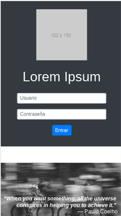
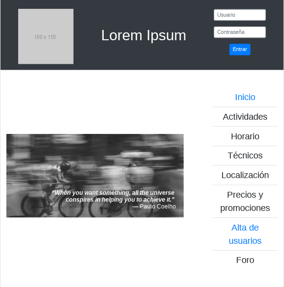
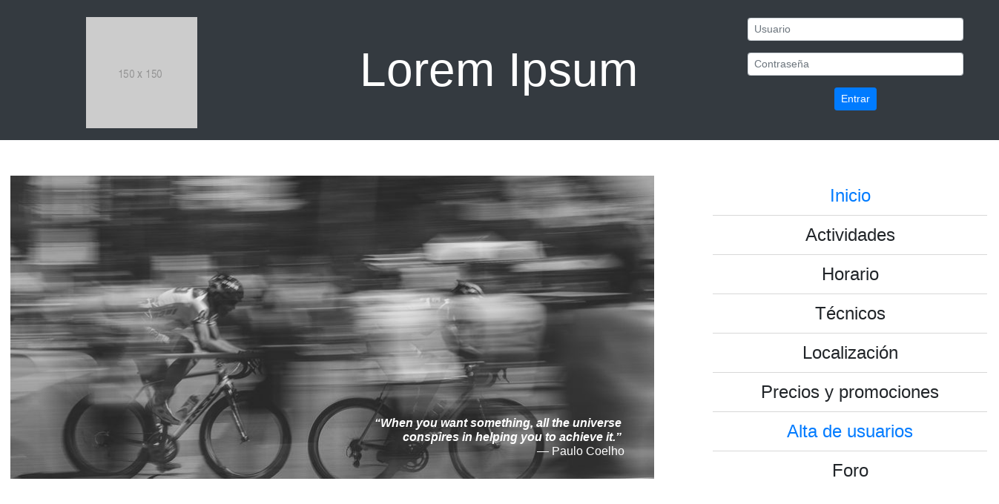
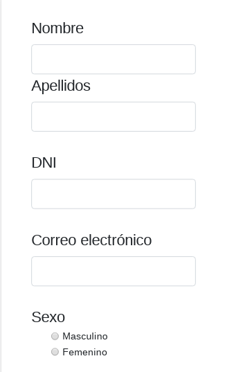
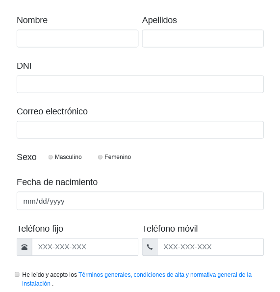
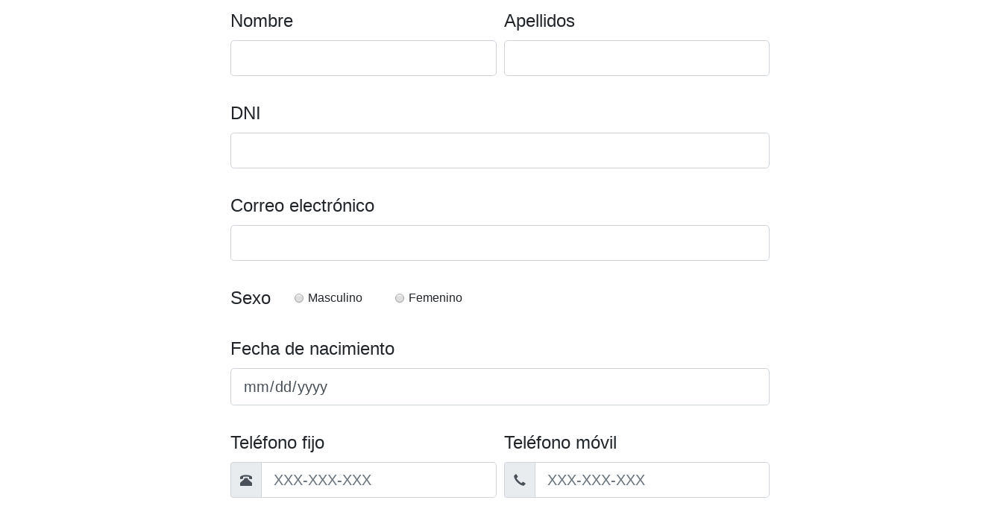
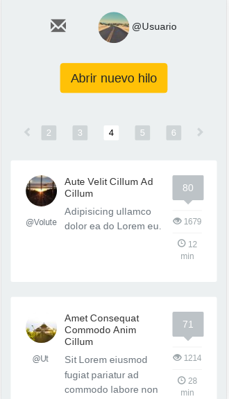
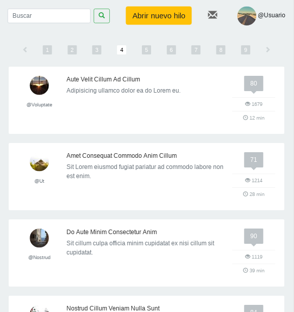
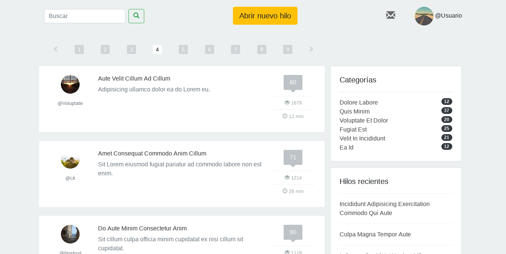

# Cómo se hizo

###### Ignacio Mas Mesa -- Programación Web

## Documentación de la práctica evaluable I
En este documento se explica el desarrollo de la práctica, las dificultades encontradas, los resultados obtenidos y posibles mejoras que se podrían realizar.

El resultado final se puede observar en http://cronos2.github.io/pw/. Para descargarlo se puede clonar el repositorio (https://github.com/cronos2/pw/) y ejecutar `git branch gh-pages` o directamente [descargar el contenido de esa rama en formato `.zip`](https://github.com/cronos2/pw/archive/gh-pages.zip).

Nótese que los formularios producen un error HTTP [405 Method Not Allowed](https://httpstatuses.com/405). Esto depende de la configuración de los servidores de GitHub, que no permiten las peticiones HTTP por método POST. En particular, para *iniciar sesión* será necesario visitar manualmente la URL http://cronos2.github.io/pw/index2.html.

## Metodología de desarrollo

Desde un primer momento queda claro que deben tomarse precauciones para evitar que el desarrollo sea más arduo y tedioso de lo necesario. Por ejemplo, todos los documentos que vamos a crear deben incorporar una cabecera (*header*) y un pie de página (*footer*) con cierto contenido estático (i.e., no cambia de un documento a otro). Mantener cada archivo `.html` con su propia versión de la cabecera y del pie de página puede resultar impracticable en cuanto queramos realizar una modificación global, por mínima que sea, de alguna de estas secciones.

Por tanto, lo lógico sería mantener el contenido de las mismas en ficheros aparte que se *incluyan* en el documento final, de modo que se puedan editar desde un único lugar. Si bien es cierto que esto podría automatizarse con un poco de *scripting* y alguna herramienta de edición de texto avanzada como `sed` o `awk`, podemos ir un paso más allá y hacer uso de un sistema de plantillas (*templates*) que gestione toda esta lógica por nosotros. Además, con esto conseguimos no sólo la habilidad de insertar porciones (*snippets*) de código en lugares arbitrarios de nuestros documentos sino que también permite crear árboles de herencia, de modo que una plantilla pueda extender a una plantilla base y alterar las secciones clave del documento que varían de una a otra vista, como el título, los archivos CSS a incluir (*assets*) o el contenido principal del documento.

Una vez motivado el uso del sistema de plantillas hemos escogido usar [Nunjucks](https://mozilla.github.io/nunjucks/), el lenguaje de plantillas de Mozilla. Con esto también ganamos la integración con [webpack](https://webpack.js.org/) que nos permite automatizar la compilación de las plantillas con un poco de configuración.

Así, por cada documento que queramos generar añadiremos una *regla* al archivo de configuración de `webpack` (`webpack.config.js`) con la información necesaria asociada (nombre del archivo de salida, nombre de la plantilla a usar, variables de contexto, etc.)

Una vez hecho esto deberemos *compilar* las plantillas para generar los archivos `.html` deseados. Para que el desarrollo se haga más llevadero podemos usar la opción `--watch` que *vigila* los archivos necesarios para la compilación y recompila cada vez que detecta un cambio.

Nótese que el uso de JavaScript sólo será necesario durante el desarrollo puesto que los documentos generados contendrán HTML y CSS. Las únicas excepciones serán la barra de navegación y la sección de últimas noticias, como veremos más adelante.

Asimismo, durante el desarrollo se ha tratado de conseguir que los documentos generados cumplan con los estándares de _**responsive design**_, i.e., que se puedan visualizar y se pueda interactuar correctamente con ellos desde (virtualmente) *cualquier* dispositivo. Para asegurarse de ello se ha usado el inspector web de Chrome (versión 65.0.3325.181 para Linux Debian 64-bit).

Para conseguir que el diseño se adapte a las distintas resoluciones disponibles en el mercado se ha utilizado la librería [Bootstrap](https://getbootstrap.com/). De nuevo, podríamos haber reinventado la rueda creando nosotros mismos el sistema de rejilla (*grid layout*) que le caracteriza, pero no sólo es innecesario sino que además conseguimos muchas otras ventajas gracias a su uso. A destacar:

* Filosofía *mobile first*
* Unificación del *tema* de los distintos documentos al usar una paleta de colores y unas componentes con un diseño armonizado
* Clases de utilidad (*utilities*) que permiten modificar de forma sencilla el tamaño, *display*, márgenes, posicionamiento, colores, etc. de los elementos del documento
* Una [barra de navegación](https://getbootstrap.com/docs/4.0/components/navbar/) con un diseño elegante y muy potente que se *colapsa* en pantallas pequeñas pero puede ser desplegada para inspeccionar el contenido (mediante JavaScript)
* La consistencia que aporta aplicar una hoja de estilos de *reinicio* ([Reboot](https://getbootstrap.com/docs/4.0/content/reboot/) que normaliza y homogeiniza el aspecto visual de los elementos a lo largo de todo el espectro de navegadores, cada uno con su propia *user agent stylesheet*. Si bien la práctica sólo se evalúa con el navegador Chrome es una buena consideración a tener en cuenta en casi cualquier situación realista
* El uso de `display: flex`, la alternativa moderna a todos los *hacks* históricamente necesarios para centrar contenido, dividir en columnas, etc. Además su soporte está ya bastante [extendido](https://caniuse.com/#feat=flexbox) con más del 95% de los usuarios de la web

El contenido real de la página no resulta relevante para el desarrollo de la práctica, no obstante, debe existir cierto contenido para comprobar que el diseño es correcto. Por ello se ha seguido la tradición de introducir pedazos de [Lorem ipsum](https://www.lipsum.com/) en los lugares necesarios. De igual modo, lo único importante de las imágenes de cara a esta práctica es su tamaño, por lo que se han usado algunos servicios de imágenes *placeholder* [1](picsum.photos) [2](https://placeholder.com/).

Para emular un comportamiento más *realista* y simplificar la implementación en un futuro de un verdadero sistema de autenticación se han creado los documentos `login.html` y `logout.html` que simplemente redirigen, mediante una etiqueta `<meta>`, a `index2.html` e `index.html` respectivamente.

No debemos olvidar que los documentos generados deben cumplir con los estándares del W3C. Para comprobarlo se ha creado un pequeño script que usa la librería [`w3cjs`](https://github.com/thomasdavis/w3cjs) que, mediante la API que expone el validador del W3C, comprueba que los archivos especificados son aceptables.

Asimismo, una de las desventajas de usar un sistema de plantillas es la mala gestión de los *whitespaces* y la indentación de los resultados generados. Para poder inspeccionar cómodamente los documentos compilados en caso de ser necesario se aplica, después de la compilación, la herramienta `tidy` de [HTML Tidy](http://www.html-tidy.org/), con especial interés en la reindentación del código. Esto resulta particularmente interesante para revisar los errores y/o *warnings* que el validador del W3C reporte, ya que obviamente la salida del validador es referente al documento compilado y no a las plantillas.

Finalmente, para automatizar todo este proceso se han creado diversos scripts en el archivo `package.json` que se pueden ejecutar mediante `npm`, así como un fichero `makefile` para la gestión de aspectos menos relacionados con la propia compilación de las plantillas (como la organización de los directorios de trabajo). Entre ellos se incluye uno para la publicación del sitio web compilado en GitHub Pages y otro para la compilación de este mismo documento, que es el `README.md` del repositorio.

## Resultados obtenidos

Como hemos mencionado anteriormente, se ha tratado de conseguir que los documentos HTML generados sean *responsive design*. A excepción del horario, que no se ha conseguido hacer caber en pantallas *pequeñas* (`<768px`), y salvo algún posible desliz, todos los documentos son perfectamente funcionales en cualquier resolución (a partir de `350px` de ancho).

A continuación se adjuntan algunas capturas obtenidas con el inspector web de Chrome para el Galaxy S5 (`360 x 640`), el iPad (`768 x 1024`) y un portátil convencional (`1364 x 682`).

#### Inicio

#### Registro

#### Foro

### Otras consideraciones

* La sección de actividades presenta a la derecha una subsección de últimas noticias que embebe un perfil de Twitter (por defecto el del propio Twitter, debería modificarse por el del propio gimnasio) en el documento
* El diseño del horario se ha inspirado en el de la web del [gimnasio YO10](http://www.yodiez.com/horario.html)
* En la pestaña de localización se incluye un mapa de la zona (por defecto centrado en la ETSIIT, debería modificarse por el propio gimnasio). Aunque remota, se contempla la posibilidad de que los usuarios naveguen con JavaScript desactivado y se incluye la dirección en un tag `<noscript>`.
* El diseño de la sección de precios y promociones se ha inspirado en el de esta [plantilla](https://codepen.io/catcode/pen/AdoGL)
* El diseño del foro se ha inspirado en el de esta [plantilla](http://preview.themeforest.net/item/forum-website-html-template/full_screen_preview/7968760)
* Los documentos generados han pasado por el validador del W3C y sólo presentan dos *warnings*: uno relacionado con el uso de `input[type=date]` y su [*escaso* soporte](https://caniuse.com/#feat=input-datetime) en los navegadores; y otro porque se usa el atributo `lang="es"` en la etiqueta `<html>` pero el contenido real son extractos de Lorem ipsum. Ninguno de ellos es de clara aplicación por lo que a efectos prácticos el sitio web cumple con los estándar del W3C.
* Asimismo, se ha intentado tener en cuenta el uso de tecnologías asistivas, haciendo uso de las etiquetas semánticas y cuidando que todo el contenido posea una descripción textual asociada que lo explique (aunque no se muestre en navegadores normales gracias a la clase `sr-only`, *screen readers only*). De este modo, las imágenes tienen un atributo `alt`, las etiquetas `<section>` y `<article>` tienen *headings* (`<h1>-<h6>`), los campos de los formularios tienen etiquetas `<label>` (mediante el atributo `for`) o texto descriptivo (mediante el atributo `aria-label`) asociadados, etc.

## Posibles mejoras

Amén de las [*issues* abiertas](https://github.com/cronos2/pw/issues) que pueden encontrarse en el repositorio, podemos mencionar:

* Normalización de los elementos del diseño. La navegación por el sitio no es una experiencia única sino que cada sección presenta disconformidades con el resto y el conjunto resulta heterogéneo.
* Pulir el diseño a nivel local, parcheando las posibles imperfecciones de posicionamiento, color, tamaño, etc. Normalmente esto requiere un estudio pormenorizado y alteraciones muy ligeras de los archivos de estilo (e.g. reducir levemente el tamaño de fuente, desplazar `2px` a la derecha un contenido...).
* Aplicar lo referido en la sección de localización a la barra de navegación y la sección de últimas noticias. Aunque remota, como hemos comentado, la posibilidad de que el usuario no tenga activada la ejecución de JavaScript en su navegador es real y al menos debería avisársele de que para poder disfrutar de todas las capacidades del sitio es necesario que lo active. Lo idóneo sería encontrar un contenido de repuesto que insertar en lugar del *principal* en caso de que JavaScript no está disponible y que mantenga aproximadamente la *misma* funcionalidad.
* Refactorizar parte del código HTML y CSS, en especial el del foro. Se podría reutilizar mucho más código abstrayendo ciertos patrones que se repiten a sus propias componentes componibles (*composable*), valga la redundancia.
* Mejorar la experiencia del desarrollador intentando mantener la consistencia entre las herramientas. Ahora mismo el reparto de trabajo entre el `makefile` y los *scripts* de `package.json` es más por cuestiones logísticas que semánticas y resulta confuso. Además en el directorio principal conviven diversos archivos de configuración y de *scripts* poco relacionados entre sí que no contribuyen a la organización y el orden.
* Incluir un carrusel (*slideshow*) en algunas secciones como por ejemplo el detalle de una actividad. Esto se puede conseguir usando [únicamente CSS](https://codepen.io/daysahead/pen/mJqBge), aunque en ese caso el usuario no retiene el control sobre la sucesión de imágenes. Otra opción sería incluir algún *plugin* ligero en JavaScript como [Peppermint.js](http://wd.dizaina.net/en/scripts/peppermint/) o [simple-slider](http://ruyadorno.github.io/simple-slider/) (q.v. http://microjs.com/#slideshow).
